# 🌐 Awesome Blockchain Infrastructure

  

  
  
  
  
  
  

---

### 🚀 Top Blockchain Infrastructure & Web3 Node Ecosystem

**A Curated Directory of SaaS RPC Platforms, Open-Source Execution Clients, Load Balancers & Data Indexers**  
*Focused on RPC Access, Node Deployment, Multi-Chain Gateway APIs, DePIN, and Enterprise Decentralized Infrastructure.*

🗓️ **Last updated: September 2026**

---

## 📖 Overview & SEO Summary

This repository tracks premier **SaaS platforms** and **open-source GitHub projects** for **Blockchain Infrastructure**. These production-grade tools provide high-throughput RPC endpoints, custom node client deployment, real-time data indexing, and automated failover routing for developers building on Ethereum, Solana, Bitcoin, Polygon, Optimism, Arbitrum, Base, and multi-chain Web3 ecosystems without the overhead of manually managing node clusters.

Whether you require managed SaaS infrastructure with 99.99% SLAs or modular Rust/Go open-source clients for self-hosted vendor-independent deployments, this directory offers a side-by-side comparison of market leaders, open indexers, and proxy gateways.

---

## 📑 Table of Contents

- [☁️ SaaS / Hosted Platforms](#-saas--hosted-platforms)
- [🛠️ Open-Source GitHub Projects](#️-open-source-github-projects)
- [🏗️ Architectural Recommendations](#️-architectural-recommendations)
- [🤝 How to Contribute](#-how-to-contribute)
- [💖 Support & Community](#-support--community)
- [📈 Star History](#-star-history)
- [⚠️ Disclaimer](#️-disclaimer)

---

## ☁️ SaaS / Hosted Platforms

📊 **Market Size & Sector Dynamics**:  
The global **Blockchain Infrastructure & RPC Node Market** is estimated at **~$3.8 Billion in 2026** and is projected to reach **~$12.5 Billion by 2030 (28.4% CAGR)** driven by multi-chain expansion, Layer-2 rollups, and enterprise Web3 integration. The sector is **moderately concentrated at the top**—led by category unicorns (Alchemy, Infura, Blockdaemon, QuickNode)—yet maintains a **vibrant, highly fragmented tail** of specialized node providers, regional RPC gateways, and privacy-focused RPC routes.

*The table below lists top SaaS RPC providers, sorted by **Company Size (Valuation / Revenue)** in descending order:*

| 🏢 Platform | 📝 Description | 💰 Company Size (Valuation / Rev) | 🏷️ Starting Paid Tier | 🎁 Free Tier / Free Trial Limit |
|---|---|---|---|---|
| **[Alchemy](https://www.alchemy.com/)** | Premier Web3 development platform providing high-performance RPC access, enhanced APIs, Notify, and developer suite across Ethereum and multi-chain networks. | **~$10.2B Valuation** ($100M+ ARR) | $49/month (Growth Tier) or $0.525 / 1M Compute Units | 30,000,000 Compute Units (CUs)/month (300 CUPS throughput) |
| **[Infura](https://www.infura.io/)** | Consensys-owned Ethereum RPC infrastructure provider & default MetaMask backend supporting 20+ EVM networks. | **~$7.0B Valuation** (Consensys parent valuation) | $50/month (Developer Plan, 15M credits/day) | 3,000,000 credits/day (~100,000 requests/day, 2,000 credits/sec rate limit) |
| **[Blockdaemon](https://www.blockdaemon.com/)** | Enterprise-grade institutional blockchain node infrastructure, staking API, MPC wallet platform, and node management. | **~$3.25B Valuation** (Series C) | Quote-based / Custom sales (Starter plan includes 65M CUs/month) | 3,000,000 Compute Units/month (5 RPS rate limit, 1 Test Key) |
| **[QuickNode](https://www.quicknode.com/)** | High-speed multi-chain RPC infrastructure platform supporting 80+ blockchain protocols with global latency routing. | **~$800M Valuation** (Series B) | $49/month (Build Plan, 80M credits) | 10,000,000 API Credits/month (15 RPS throughput limit) |
| **[Ankr](https://www.ankr.com/)** | DePIN-based multi-chain RPC infrastructure built around a globally distributed physical node network. | **~$100M+ Valuation** ($20M-$40M ARR / ANKR Token Market) | $10 for 100M credits (PAYG) or $500/month (Subscription) | 200,000,000 API Credits/month (Public RPC available without signup) |
| **[Moralis](https://moralis.io/)** | Enterprise Web3 data platform providing structured real-time APIs & RPC endpoints across 40+ EVM chains and Solana, with Onchain Skills for AI agents. | **~$15M - $30M Est. Rev** (Series A) | $149/month (Starter Plan, 2M CUs/month) | 40,000 Compute Units/day (~1,200,000 CUs/month, 1,000 CU/s rate limit) |
| **[Chainstack](https://chainstack.com/)** | Multi-chain protocol platform supporting 70+ chains with Hybrid Cloud deployments for dedicated node management in private clouds. | **~$10M - $20M Est. Rev** | $49/month (Growth Plan, 20M Request Units) | 3,000,000 Request Units (RUs)/month (25 RPS rate limit) |
| **[Tatum](https://tatum.io/)** | Enterprise Web3 infrastructure platform combining RPC endpoints, Wallet SDK, Blockchain Data APIs, and smart contract tools. | **~$10M - $20M Est. Rev** (Series A) | $25/month (Starter Plan, 4M credits/month) | 100,000 lifetime credits (3 RPS rate limit) |
| **[GetBlock](https://getblock.io/)** | Web3 RPC node provider offering instant JSON-RPC and WebSocket access to 130+ blockchain networks. | **~$5M - $10M Est. Rev** | $39/month (Starter Plan, 90M CUs/month) | 50,000 Compute Units/day (~1,500,000 CUs/month, 20 RPS limit) |
| **[NOWNodes](https://nownodes.io/)** | Cost-effective shared and dedicated RPC node provider supporting JSON-RPC and WebSocket connections. | **~$1M - $5M Est. Rev** | €20/month (~$22/month starting shared plan) | 100,000 RPC requests/month (1 API key included) |

---

## 🛠️ Open-Source GitHub Projects

The open-source blockchain infrastructure ecosystem is remarkably mature, featuring production-grade execution layer clients, lightweight light clients, fault-tolerant RPC load balancers, and ultra-fast indexers. 

*Projects are sorted by **GitHub Stars_Count (descending)**. Click any Stars_Badge to inspect stargazers:*

1. **[go-ethereum (Geth)](https://github.com/ethereum/go-ethereum)**  
     
   ⚡ Official Go implementation of the Ethereum protocol. The foundational and most widely adopted execution layer client in Web3 history.

2. **[SubQuery](https://github.com/subquery/subql)**  
     
   📊 Decentralized multi-chain data indexing framework supporting EVM, Substrate, Solana, Cosmos, and Algorand.

3. **[Foundry](https://github.com/foundry-rs/foundry)**  
     
   🛠️ Ultra-fast, modular toolkit for Ethereum application development and local node simulation written in Rust (Forge, Cast, Anvil, Chisel).

4. **[Reth](https://github.com/paradigmxyz/reth)**  
     
   🦀 Modular, ultra-high-performance Ethereum execution layer client written in Rust. Powers Coinbase's Base L2, Berachain, Gnosis Chain, and BSC execution layers. Apache 2.0 licensed.

5. **[Graph Node](https://github.com/graphprotocol/graph-node)**  
     
   🔍 GraphQL indexing engine for Ethereum and IPFS, driving open data subgraphs across the decentralized Web3 network.

6. **[Helios](https://github.com/a16z/helios)**  
     
   🔒 Rust-based, trustless, portable Ethereum light client that synchronizes in milliseconds directly inside web browsers or CLI without full nodes.

7. **[Hyperledger Besu](https://github.com/hyperledger/besu)**  
     
   ☕ Enterprise-grade, mainnet-compatible Ethereum client written in Java designed for both public networks and private permissioned consortiums.

8. **[Nethermind](https://github.com/NethermindEth/nethermind)**  
     
   ⚡ High-performance C# .NET Ethereum execution client engineered for high-throughput validators, enterprise node operators, and staking pools.

9. **[Ponder](https://github.com/ponder-sh/ponder)**  
     
   📦 Open-source, developer-friendly TypeScript EVM indexer providing automatic schema generation, hot-reloading, and fast event processing.

10. **[Rindexer](https://github.com/joshstevens19/rindexer)**  
      
    🚀 High-throughput EVM indexer written in Rust with Postgres storage delivering 474+ events/second indexing speed.

11. **[Forest (Filecoin)](https://github.com/ChainSafe/forest)**  
      
    🌲 Rust implementation of the Filecoin protocol providing snapshot generation 10x faster with 88% less RAM usage than Lotus. Powers core mainnet bootstrap nodes.

12. **[TzKT](https://github.com/baking-bad/tzkt)**  
      
    🏛️ Advanced C#-based blockchain indexer, REST, and WebSocket API provider built specifically for the Tezos blockchain ecosystem.

13. **[EVM Indexer](https://github.com/eabz/evm-indexer)**  
      
    🗄️ Scalable SQL-first indexer for EVM-compatible blockchains, ideal for relational query paradigms.

14. **[nodecore](https://github.com/drpcorg/nodecore)**  
      
    🔀 Fault-tolerant, API-agnostic RPC load balancer supporting JSON-RPC, WebSocket, and gRPC across 15+ chain ecosystems (EVM, Solana, Bitcoin, Cosmos, Sui).

15. **[Chaindexing](https://github.com/chaindexing/chaindexing-rs)**  
      
    ⚙️ Multi-chain EVM indexer built in Rust for multi-database compatibility and zero-downtime schema migrations.

16. **[proxyd](https://github.com/ethereum-optimism/infra)**  
      
    🛡️ Production RPC proxy and failover balancer maintained by Optimism with Kubernetes-style readiness/liveness health probes.

17. **[rpcgate](https://github.com/BinaryArchaism/rpcgate)**  
      
    🚦 Self-hosted proxy and load balancer for EVM RPC providers featuring adaptive p2cewma latency routing and Grafana dashboards.

---

## 🏗️ Architectural Recommendations

- **High-Performance Execution Layer**: Combine **Reth** or **Geth** for EVM node processing.
- **RPC Failover & Load Balancing**: Deploy **proxyd** (Optimism) or **nodecore** (dRPC) in front of multiple SaaS backends (Alchemy, Infura, QuickNode) to eliminate single points of failure.
- **Fast Data Indexing**: Implement **Rindexer** (Rust) or **Ponder** (TypeScript) for custom application state queries, or **SubQuery** for multi-chain support.
- **Lightweight Verification**: Integrate **Helios** light client to trustlessly verify RPC responses directly on end-user devices.

---

## 🤝 How to Contribute

Contributions are welcome! To add or update an entry:
1. 🍴 **Fork** this repository.
2. 📝 **Edit** `README.md` following the table or list format.
3. 🔗 Include project name, homepage/GitHub link, factual description, and category.
4. 📬 Submit a **Pull Request** with a brief summary of additions.

---

## 💖 Support & Community

Thank you for exploring **Awesome-Blockchain-Infrastructure**! 🚀  
If you find this repository valuable, please consider:
- 🌟 **Starring** this repository to increase visibility for Web3 infrastructure tooling.
- 🔀 **Forking** and contributing new tools, benchmarks, or platforms.
- 📢 **Sharing** with fellow developers, infrastructure engineers, and node operators.

---

## 📈 Star History

---

## ⚠️ Disclaimer

- This list is **community-curated** for educational and reference purposes. Inclusion does not imply official endorsement.
- Running production blockchain infrastructure requires operational expertise in networking, SSD/NVMe storage, and security hardening.
- SaaS providers offer convenience but introduce vendor lock-in risk. High-availability Web3 architectures should employ multi-provider failover routing.

---

  <b>Built with ❤️ for Web3 developers, node operators, infrastructure engineers, and blockchain architects.</b>

